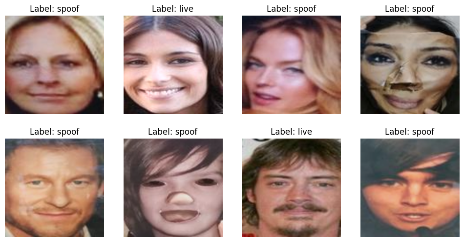
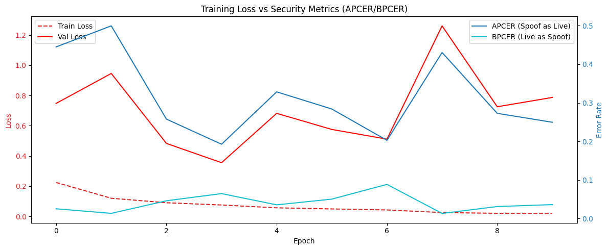
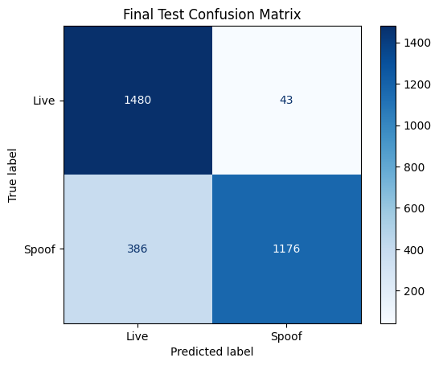

# eKYC-facial

Design and deploy a facial identity verification pipeline that:
- Rejects low-quality inputs as a first safe-guard
- Detects spoofing vs live faces
- Serves predictions via a production-style API on AWS

## Quick Start

Link to project: https://project-spoof.yeo-menghan.com


## Architecture
```
Client (image upload)
        |
        v
Image Quality Gate (Optional and requires calibration)
(blur / brightness / face size)
        |
        v
Face Liveness Model (PyTorch)
        |
        v
Inference API (FastAPI)
        |
        v
AWS Deployment (EC2) + CloudWatch logging
```

## Getting Started

```bash
uv sync # get all dependencies
source .venv/bin/activate
```

### Repo Structure
```
eKYC-facial/
│
├── .github/
│   └── workflows/
│       └── deploy.yml
│   
├── data/
│   └── celeba-spoof-mini/
│
├── quality/
│   └── checks.py              
│   └── calibration.py  # calibrate to camera
│   └── upload_s3.py    # upload blaze_face_short_range.tflite to s3
│
├── model/
│   ├── blaze_face_short_range.tflite   # downloaded from mediapipe
│   └── mobilenet.onnx  # from training pipeline
│
├── training/
│   └── train.ipynb  # full training-evaluation-upload s3 pipeline
│
├── api/
│   ├── Dockerfile
│   ├── requirements.txt
│   └── app.py
│
├── frontend/
│   ├── Dockerfile
│   ├── requirements.txt
│   └── app.py
│
├── tests/  # TODO
│   ├── test_api.py          # Pytest for FastAPI endpoints
│   └── test_quality.py      # Test cases for blur/brightness
│
├── README.md
├── docker-compose.yml
└── pyproject.toml
```

### Running individual components

Run calibration for the quality checks:
```bash
python -m quality.calibration
```
Utilise the calibration results to suit your camera's needs (update `quality/checks.py`)

Run application to test locally
```bash
# First terminal - backend
python -m api.app
# Second terminal - streamlit frontend
streamlit run frontend/app.py
```

Using Docker
```bash
# Open docker app first
docker compose up --build
```

### Github Actions Secrets

`deploy.yml` requires these secrets, please key in your own from AWS:
1. AWS_ACCESS_KEY_ID
2. AWS_SECRET_ACCESS_KEY
3. EC2_HOST
4. EC2_SSH_KEY

Github Actions will trigger on a push to main

## Image Quality Assessment (Input Gating)

Purpose: Reject bad inputs before ML inference (industry best practice).

Checks
- Brightness Check: Validates that the image is neither too dark nor too bright.
- Blur Detection: Measures image sharpness using the Laplacian variance.
- Face Detection & Size Check: Detects faces using a MediaPipe BlazeFace model and ensures the face occupies a sufficient portion of the image.

Additional Implementations (TODOs):
- [ ] Head Pose Estimation: Reject profiles. The user must face the camera.
- [ ] Eye Occlusion: Detect if the user is wearing heavy sunglasses (standard eKYC requirement).

Run file:
```bash
python -m quality.checks
```

Sample Results:
```bash
{
  "is_valid": true,
  "scores": {
    "brightness": 120.45,
    "blur_variance": 500.32,
    "face_coverage": 0.2547
  },
  "reasons": [],
  "face_bbox": [100, 80, 150, 150]
}

{
  "is_valid": false,
  "scores": {
    "brightness": 30.12,
    "blur_variance": 120.75,
    "face_coverage": 0.05
  },
  "reasons": [
    "Bad lighting",
    "Image blurry",
    "Face too small/far"
  ],
  "face_bbox": [90, 70, 50, 50]
}
```

## Face Liveness / Anti-Spoofing Model 

The task is to create an image (binary) classification model that differentiates between live and spoof. This section will dive into the model selection, training pipeline and model deployment,

### Model Selection

Model
- Backbone: MobileNetV3-Small or EfficientNet-B0 as they are optimized for the "mobile-first" nature of eKYC.
- Input: cropped face
- Output: liveness probability

Feature,MobileNetV3 (Small/Large),YOLO-n (Nano variants)
Primary Task,Image Classification (Live vs. Spoof),Object Detection (Finding & naming boxes)
Architecture,"Optimized for 1:1 classification. Efficient ""Depthwise Separable Convolutions.""","Optimized for ""Dense Prediction"" (detecting many objects at once)."
Overhead,Extremely Low. Just a backbone and a tiny head.,"High. Includes ""Neck"" (FPN/PAN) and ""Heads"" for box regression and masking."
Deployment,Perfect for AWS Lambda or basic EC2 CPUs.,Better on GPUs; higher memory/compute footprint for the same input size.
Input Focus,Looks at the entire cropped face for global texture/noise cues.,"Focused on localizing edges to draw boxes, which can miss subtle global moiré patterns."

Using YOLO for liveness is "overkill"—you are paying for box-drawing logic you don't need. MobileNet gives you higher classification precision with a fraction of the compute.

### Dataset utilised
[CelebA-Spoof](https://github.com/ZhangYuanhan-AI/CelebA-Spoof?tab=readme-ov-file). It contains 600,000+ images with 43 rich attributes, covering various spoof types (print, replay, paper cutouts).

However, for this project the [Mini version from kaggle](https://www.kaggle.com/datasets/phatntse192617/celeba-spoof-mini/data) is utilised to reduce time spent.

This is the split from `training/train.ipynb`
```
Train samples: 20413
Val samples:   3084
Test samples:  3085
Classes:       ['live', 'spoof']

Class distribution for Train:
  Class 'live' (0): 10385 samples
  Class 'spoof' (1): 10028 samples

Class distribution for Validation:
  Class 'live' (0): 1539 samples
  Class 'spoof' (1): 1545 samples

Class distribution for Test:
  Class 'spoof' (1): 1562 samples
  Class 'live' (0): 1523 samples
```

While the original dataset is largely skewed towards 'live', this mini dataset has been re-distributed.

Sample data looks as such:


> It is worth noting from preliminary visual inspection that the dataset appears to be heavily biased toward Western faces. In personal testing of the application, performance on Asian faces was observed to be comparatively lower (leading to live Asian faces being classified as spoofs)

### Transformation 

**Training Transformations**

For the training dataset, we apply data augmentation to improve model generalization:
- Resize: All images are resized to 224×224 pixels.
- Random Horizontal Flip: Each image has a 50% chance of being flipped horizontally.
- Color Jitter: Randomly adjusts brightness and contrast (±20%) to simulate varying lighting conditions.
- ToTensor: Converts images from PIL format to PyTorch tensors.
- Normalization: Standardizes image pixel values using ImageNet statistics (mean=[0.485, 0.456, 0.406], std=[0.229, 0.224, 0.225]).

**Validation & Test Transformations**

For validation and test sets, only deterministic preprocessing is applied:
- Resize: 224×224 pixels.
- ToTensor: Converts images to PyTorch tensors.
- Normalization: Same as the training set.

⚠️ Note: Random flips and color jitter are omitted from validation and test sets to ensure consistent evaluation.

Data augmentation during training (e.g., flips and brightness/contrast changes) helps the model generalize by exposing it to variations it may encounter in real-world data. Normalization standardizes input values, which stabilizes training and speeds up convergence. Deterministic preprocessing for validation and test sets ensures that evaluation metrics reflect true model performance, without being influenced by random alterations. While the dataset creators have already applied various forms of augmentation, we implemented our own standardized transformations to ensure consistency and reproducibility across all experiments.

### Training-Validation

The model uses transfer learning with a pre-trained MobileNetV3 backbone. The final classification layer is replaced with a single logit output for binary liveness detection.

The code automatically detects and uses the best available hardware:
- MPS: Apple GPU support for MacBooks with M-series chips.
- CUDA: NVIDIA GPU support.
- CPU: Fallback if no GPU is available.

The training loop leverages PyTorch with an Adam optimizer and binary cross-entropy loss, while validation tracks both the loss and ISO-standard liveness metrics (APCER and BPCER).

**1. Loss Function and Optimizer**

Loss Function: BCEWithLogitsLoss
- Used for binary classification between Live (Bona Fide) and Spoof (Attack) samples.
- Works directly with logits, avoiding the need for a sigmoid activation in the model output.

Optimizer: Adam with learning rate 1e-4 with L2 regularisation (as an attempt to close the gap between train loss and validation loss)
- Adaptive gradient optimizer suitable for most deep learning tasks.

**2. Training Loop**
Each epoch consists of a training and validation phase.

Training Phase:
1. Set the model to training mode: model.train().
2. Iterate over batches of images and labels from the training dataset.
3. Forward pass through the model to compute logits.
4. Compute loss via BCEWithLogitsLoss.
5. Backpropagate gradients and update model parameters.
6. Track batch-wise loss with a tqdm progress bar.

**3. Validation Loop**
The model is evaluated in inference mode (model.eval()) without gradient computations.
Metrics are computed per batch and averaged over the validation dataset.

ISO Liveness Metrics
- APCER (Attack Presentation Classification Error Rate): Fraction of spoof attempts incorrectly classified as live.
- BPCER (Bona Fide Presentation Classification Error Rate): Fraction of live samples incorrectly classified as spoof.

**4. Epoch Summary**
After each epoch, compute:
- Average Training Loss
- Average Validation Loss
- Average APCER and BPCER

Metrics are logged and stored in a history dictionary:
```python
history = {
    'train_loss': [], 
    'val_loss': [],
    'val_apcer': [], 
    'val_bpcer': []
}
```
which is used to plot the loss curve:



The best model was found on epoch 4:
```bash
⭐ New Best Val Loss! Model saved.
✅ Epoch 4 Finished | Train Loss: 0.0752 | Val Loss: 0.3551 | APCER: 0.1927 | BPCER: 0.0647
```

However, the gap between Train Loss (dashed red) and Val Loss (solid red) remains very large. The model is essentially "memorizing" the training set and failing to learn the general characteristics that distinguish a spoof from a live person. The massive spike in Val Loss and APCER at Epoch 7 suggests the model's weights are unstable. Even though the loss drops again after Epoch 7, it does not settle into a lower, more reliable state than it was at Epoch 3. 

### Evaluation on Test Set



```
✅ APCER (Security): 0.2436 (Goal: <0.01)
✅ BPCER (Usability): 0.0282 (Goal: <0.05)
```

- 24.4% of spoof attemps are being classified as 'Live'
- 2.8% of real users are being blocked (incorrectly flagged)
- There's still a security gap as the model is currently biased towards predicting 'Live'. It is much more likely to let an attacker in than it is to accidentally block a real person.
- The imbalance here suggests the model is struggling to find the "decision boundary" for spoofs. It is finding "Live" signals easily, but nearly 25% of your Spoof dataset looks identical to "Live" data as far as the model is concerned.

Possible improvements for future development:
- Since APCER is the problem, 'penalizing' spoof-misses more heavily can be a solution.
- A closer inspection at the missed spoofs and attempt to categorise them to a specific type of attack (i.e. high-quality screens, paper printouts, lighting condition etc.)
- Try a different confidence threshold (currently 0.5) - as the model will require a much higher confidence before calling an image 'Live'. This will lower APCER but likely increase BPCER (trade-off) - a DET (Detection Error Trade-off) curve will be useful in this analysis.

### Model Export & Deployment 

Export configuration:
- `opset_version=17`: Supports MobileNetV3 operators natively and avoids legacy op issues.
- `export_params=True`: Embeds trained weights inside the ONNX file.
- `do_constant_folding=True`: Optimizes the graph by precomputing constant expressions.
- `input_names / output_names`: Makes the ONNX graph easier to reference and debug.
- `dynamic_axes`: Allows variable batch sizes at inference time.
- `dynamo=False`: Forces the legacy exporter, avoiding PyTorch Dynamo-related export errors.

Output: The model is saved as a self-contained ONNX file ready for deployment.

Model is thereafter uploaded to S3.

## Inference API 

This backend provides a lightweight eKYC face liveness inference service built with FastAPI and ONNX Runtime, designed for low-latency, production-friendly deployment.

Endpoint
```bash
POST /v1/liveness
```

Request:
- Multipart form upload
- Field: file
- Supported formats: JPEG / PNG
- Optional query param: `enable_checks=true|false` (default: true)

Response:
```bash
{
  "status": "SUCCESS",
  "is_live": true,
  "liveness_score": 0.12,
  "confidence": 0.88
}
```

If quality checks fail:
```bash
{
  "status": "QUALITY_FAILED",
  "reasons": ["blur", "low_brightness"],
  "scores": {
    "blur": 0.42,
    "brightness": 0.18
  }
}
```

### API design choices
Model Inference (ONNX Runtime)
- The liveness model is exported to ONNX and loaded once at startup using onnxruntime.InferenceSession.
- This avoids Python framework overhead at runtime and enables:
    - Faster CPU inference
    - Easier deployment across platforms
    - Framework-agnostic serving

Preprocessing Alignment
- Images are resized to 224×224, normalized using ImageNet mean/std, and converted to NCHW float32. This exactly mirrors the PyTorch training pipeline to avoid training–serving skew.
- Explicit float32 casting prevents common ONNX runtime type mismatches.

Logit-Based Decision
- The model outputs a single logit.
- A sigmoid is applied in the API layer to compute a probability:
    - `liveness_score` = probability of spoof
    - `is_live` is derived using a 0.5 threshold
- This keeps the model output flexible for future threshold tuning or ISO metric calibration (e.g. APCER/BPCER).

## Frontend
The frontend is built with streamlit to demonstrate the eKYC liveness pipeline end-to-end. It provides a human-in-the-loop interface for testing liveness detection and support both camera capture and image upload. The interface also surface model decisions, confidence, and quality gate feedback clearly.


### User Flow
1. Capture a photo via webcam (`st.camera_input`) or upload an image (`st.file_uploader`)
2. Optionally enable/disable the image quality gate
3. Submit the image to the backend inference API
4. View:
    - Live / Spoof decision
    - Confidence score
    - Quality failure reasons (if any)

## Github Actions & AWS Deployment

This deployment setup uses GitHub Actions + Docker + AWS ECR + EC2 to deliver a fully automated, reproducible production deployment of the eKYC liveness system.

A push to main triggers a complete build-and-deploy cycle for both backend and frontend services.

### Overview
Trigger: push to main branch

Target
- Single EC2 instance (t3.small with 2 vCPUs and 2GB RAM - the highest configuration for the free-tier and sufficient for the model utilised with additional headroom)
- Docker Compose–managed services (Separate Dockerfile in `api/` and `frontend/`)

Artifacts
- Backend API container
- Frontend Streamlit container
- Models fetched securely from S3 at build time

Flow:
1. Checkout source code
2. Authenticate to AWS
3. Download trained models from S3
4. Build and push Docker images to ECR
5. Copy `docker-compose.yml` to EC2
6. Pull and restart services on EC2

### Design & Implementation Choices

Github Actions as CI/CD
- Versioned deployment pipeline and tightly coupled with source control - each deployment corresponds to a specific git commit (`IMAGE_TAG = github.sha`)
- Docker images are tagged with the exact Git SHA which guarantees full traceability and easy rollback by redeploying a previous tag.

Model Distribution via S3
- Models are not stored in Git. Downloaded at build time from a private S3 bucket.
- This allows model updates without code changes (from the training pipeline manually). This separates the training pipeline from the api / frontend infrastructure.

Amazon ECR for image registry adn separate frontend / backend images
- Native AWS container registry:
    - IAM-based authentication
    - Low-latency pulls from EC2
- Backend and frontend are built and pushed independently, allowing future scaling, iteration or replacement of either service. 
- Backend exposed on port `8000`
- Frontend exposed on port `8501`

Environment-based configuration
- `.env` file is generated dynamically on EC2:
    - `IMAGE_TAG` ensures both services run the same release
    - `API_URL` points the frontend to the backend
- Keeps images environment-agnostic and portable.

## Future TODOs
- [ ] Deepfake attacks
- [ ] Temporal liveness
- [ ] Model distillation
- [ ] VLM-based cues
- [ ] Zero downtime redeployment strategy

